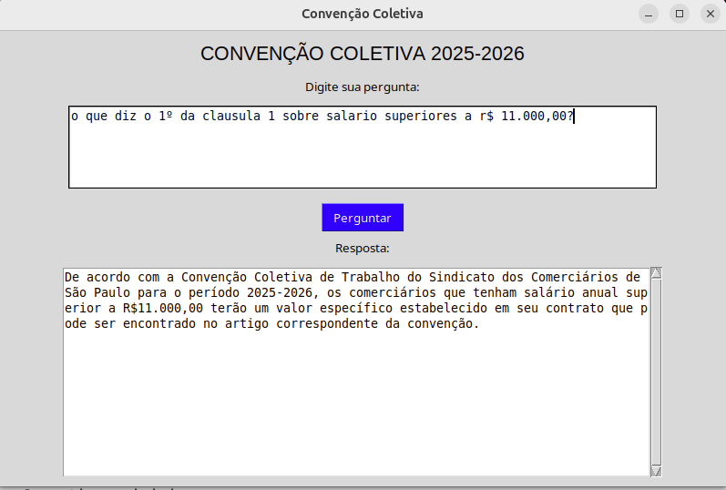

05/03/2026
procurei arquivos para o projeto
encontrei 4 arquivos para ser analisado com o grupo
conversamos sobre as estruturas

09/03/2026
abri um arquivo em PDF, transformei em texto e criou
e salvou no drive.
usando a biblioteca pypdf.
elaborei perguntas para projeto

10/03/2026
conclui as 10 perguntas.

11/03/2026
comecei a criar o script
configurei para instalar as bibliotecas
-pip install langchain-community pypdf
-import getpass
-import os
-from langchain_core.documents import Document
li os conceitos e começando entender os codigos

12/03/2026
- montando o projeto.
- organizado os comando.
- teste de buscas e respostas.
- feito algumas testes de consultas.

Primeira pesquisa_similaridade
# pergunta  " local sindilojas"

# resposta: 
Sindicato dos Comerciários de São Paulo 
Rua Formosa, 99 Centro 
CEP 01049-000 - São Paulo - SP 
Fone:. 2121-5900 
e-mail: 
atendimento@comerciarios.org.br  
Sindicato do Comércio Varejista e Lojista do Comércio de São 
Paulo-Sindilojas-SP 
Rua. Cel. Xavier de Toledo, 99 - Centro Histórico de São Paulo.

- estudando mais sobre o script
- tentando mudar e obter novos resultados
- mudando os comandos e tentando ter outros resultados

16/03/2026

- Testando a VM e testando
- começando a fazer os teste no trabalho
- começando a fazer o programa 
- instalando os programas
- VS Code
- Pytorch

17/03/2026

estou testando com o cross-encoders-marco-TinyBERT-L4

dando o resultado 

Cross-Encoder Relevance Scores:
tensor([[ 0.8305],
        [-0.9714],
        [-0.8356],
        [ 0.9199]])
 
 vou testar outros modelos 

 18/03/2026

 apos explicação do professor.
 tentando usar e modificar o codigo para meu projeto.

alguns resultados apos teste de codigo pronto sem usar o do professor.

 Input question: Qual é o índice de reajustamento previsto na cláusula  REAJUSTAMENTO?
Top-3 lexical search (BM25) hits
	5.728	O 13º salário deve ser calculado com base no salário reajustado integralmente, conforme previsto no caput da cláusula de    reajustamento, sem parcelamento ou compensações.
	2.524	As horas extras diárias serão remuneradas com o adicional legal de 60% (sessenta por cento), incidindo o percentual sobre o valor da hora normal
	2.450	Se as férias foram concedidas entre 1º/09/2025 e a assinatura da convenção, as diferenças salariais decorrentes do reajuste devem ser pagas na folha de janeiro/2026

        Top-3 Cross-Encoder Re-ranker hits
	6.261	A empresa deve pagar as diferenças salariais de setembro a novembro de 2025 em parcela única, integrando a base de cálculo das verbas rescisórias, e comunicar o empregado no prazo máximo de 10 dias da assinatura da convenção para recebimento.
	-0.590	Empresas enquadradas como MEI, ME ou EPP (até 20 empregados) que aderirem ao REPIS têm pisos diferenciados: R$ 1.580,00 para office-boy, R$ 1.977,00 para demais e garantia de comissionista de R$ 2.372,00, além de obrigatoriedade do Plano de Assistência (cláusula 60).
	-3.436	O 13º salário deve ser calculado com base no salário reajustado integralmente, conforme previsto no caput da cláusula de reajustamento, sem parcelamento ou compensações.
Pergunta de entrada: Quais as particularidades de remuneração para MEIs, MEs e EPPs? 
Top-3 lexical search (BM25) hits 
	3.233 A empresa deve pagar as diferenças salariais de setembro a novembro de 2025 em parcela única, integrando a base de cálculo das verbas rescisórias, e comunicar o empregado no prazo máximo de 10 dias da assinatura da convenção para recebimento. 
	2.937 Empresas enquadradas como MEI, ME ou EPP (até 20 empregados) que aderirem ao REPIS têm pisos diferenciados: R$ 1.580,00 para office-boy, R$ 1.977,00 para demais e garantia de comissionista de R$ 2.372,00, além de obrigatoriedade do Plano de Assistência (cláusula 60). 
	2.820 O empregado fará jus a um abono correspondente a 02 (dois) dias de sua remuneração mensal de outubro de 2025. 

	19/03/2026

	utilizei o cogido do professor.
	fiz alteraçõoes para ler o PDF

	pdf_file_path = '/content/drive/MyDrive/UC15/PDF/sindilojas_2025_2026.pdf'
    texts_from_pdf = []
    metadatas_from_pdf = []

	alterei a query
	 query = "Como é definida a Contribuição Assistencial Negocial Empresarial na cláusula 8??"

	obtive o resultado:
	e buscou dentro do pdf e retornou:
	Reranker score: 1.573921
----------------------------------------------------------------------------------------------------
Parágrafo 1º  – A discussão em acordos coletivos de trabalho de cláusulas q ue detenham 
característica intersindical, assim entendida a matéria objeto de neg ociação (pauta) entre as 
categorias laboral e empresarial, deverá ter, sob pena de nulidade d o que venha a ser 
avençado, obrigatoriamente, a participação da entidade empresarial. 

tambem criei na query.
new_query = "Empresas fornecem vale transporte e fiscalização de uso?"
new_results = retriever.invoke(new_query)
Rank: 1
Source: /content/drive/MyDrive/UC15/PDF/sindilojas_2025_2026.pdf_page_25_chunk_2
Reranker score: 5.360256
----------------------------------------------------------------------------------------------------
excluídos quaisquer adicionais ou vantagens. 
 
Parágrafo 2º -  As empresas fornecerão o vale transporte sempre no mês anterior ao m ês a 
ser utilizado pelo empregado. 
 
Parágrafo 3º - Nos termos do Decreto n.º 95.247/87, e baseado na Declaração emi tida pelo 
empregado acerca do uso do vale transporte, é direito da empresa fi scalizar sua correta 

mais uma query
new_query = "Qual é o índice de reajustamento previsto na cláusula  REAJUSTAMENTO?"
new_results = retriever.invoke(new_query)
Results for query: 'Qual é o índice de reajustamento previsto na cláusula  REAJUSTAMENTO?'
====================================================================================================
Rank: 1
Source: /content/drive/MyDrive/UC15/PDF/sindilojas_2025_2026.pdf_page_3_chunk_3
Reranker score: 4.603594
----------------------------------------------------------------------------------------------------
instrumento,   as diferenças salariais em razão do reajuste salarial previst o no caput desta 
cláusula deverão ser pagas na folha de pagamento de janeiro/2026. 
 
2 - EMPREGADOS ADMITIDOS APÓS 1º DE SETEMBRO/24 - Aos empregados admitidos a 
partir de 16 de setembro de 20 24 e até 15 de agosto de 20 25, o reajustamento será 
proporcional, conforme tabelas a seguir: 

20/03/2026

baixei um pdf com 124 paginas para teste

====================================================================================================
Rank: 1
Source: /content/drive/MyDrive/UC15/PDF/Ed_1_PF_25_Abertura.pdf_page_41_chunk_4
Reranker score: 9.195508
----------------------------------------------------------------------------------------------------
Forense 17 6 6 
Cargo 6: Perito Criminal Federal – Área 7: 
Engenharia Civil 11 6 6 
Cargo 7: Perito Criminal Federal – Área 11: 
Engenharia Cartográfica 6 6 6 
Cargo 8: Perito Criminal Federal – Área 12: 
Medicina Legal 6 6 6 
Cargo 9: Perito Criminal Federal – Área 16: Física 
Forense 6 6 6

====================================================================================================
Rank: 2
Source: /content/drive/MyDrive/UC15/PDF/Ed_1_PF_25_Abertura.pdf_page_29_chunk_4
Reranker score: 8.835571
----------------------------------------------------------------------------------------------------
Elétrica/Eletrônica 6 6 6 
Cargo 4: Perito Criminal Federal – Área 3: Informática Forense 69 11 69 
Cargo 5: Perito Criminal Federal – Área 5: Geologia Forense 17 6 17 
Cargo 6: Perito Criminal Federal – Área 7: Engenharia Civil 11 6 11 
Cargo 7: Perito Criminal Federal – Área 11: Engenharia Cartográfica 6 6 6 
Cargo 8: Perito Criminal Federal – Área 12: Medicina Legal 6 6 6 
Cargo 9: Perito Crimi

====================================================================================================
Rank: 3
Source: /content/drive/MyDrive/UC15/PDF/Ed_1_PF_25_Abertura.pdf_page_9_chunk_2
Reranker score: 8.820333
----------------------------------------------------------------------------------------------------
Cargo 5: Perito Criminal Federal 
– Área 5: Geologia Forense 3 1 1 5 
Cargo 6: Perito Criminal Federal 
– Área 7: Engenharia Civil 2 * * 2 
Cargo 7: Perito Criminal Federal 
– Área 11: Engenharia 
Cartográfica 
1 * * 1 
Cargo 8: Perito Criminal Federal 
– Área 12: Medicina Legal 1 * * 1 
Cargo 9: Perito Criminal Federal 
– Área 16: Física Forense 1 * * 1 
Cargo 10: Perito Criminal 
Federal – Área

====================================================================================================
Rank: 4
Source: /content/drive/MyDrive/UC15/PDF/Ed_1_PF_25_Abertura.pdf_page_47_chunk_2
Reranker score: 7.637212
----------------------------------------------------------------------------------------------------
Cargo 8: Perito Criminal Federal – Área 12: 
Medicina Legal 6 6 6 
Cargo 9: Perito Criminal Federal – Área 16: Física 
Forense 6 6 6 
Cargo 10: Perito Criminal Federal – Área 17: 
Engenharia de Minas 6 6 6 
Cargo 11: Perito Criminal Federal – Área 19: 
Genética Forense 6 6 6 
Cargo 12: Perito Criminal Federal – Área 20: 
Engenharia Ambiental 6 6 6 
Cargo 13: Perito Criminal Federal – Área 21: 
Ant

====================================================================================================
Rank: 5
Source: /content/drive/MyDrive/UC15/PDF/Ed_1_PF_25_Abertura.pdf_page_41_chunk_3
Reranker score: 5.926595
----------------------------------------------------------------------------------------------------
aplicados os critérios de desempate de que tratam a alíneas “a” a “e” do subitem 18.10.1 deste edital; 
b) para os cargos de Perito Criminal Federal: os candidatos não eliminados na avaliação médica, e mais 
bem classificados, de acordo com a soma algébrica das notas obtidas na prova objetiva e na p rova 
discursiva, até os quantitativos estabelecidos a seguir, aplicados os critérios de desempate

Results for query: 'CARGO 7: PERITO CRIMINAL FEDERAL – ÁREA 11: ENGENHARIA CARTOGRÁFICA'
====================================================================================================
Rank: 1
Source: /content/drive/MyDrive/UC15/PDF/Ed_1_PF_25_Abertura.pdf_page_41_chunk_4
Reranker score: 9.150510
----------------------------------------------------------------------------------------------------
Forense 17 6 6 
Cargo 6: Perito Criminal Federal – Área 7: 
Engenharia Civil 11 6 6 
Cargo 7: Perito Criminal Federal – Área 11: 
Engenharia Cartográfica 6 6 6 
Cargo 8: Perito Criminal Federal – Área 12: 
Medicina Legal 6 6 6 
Cargo 9: Perito Criminal Federal – Área 16: Física 
Forense 6 6 6

====================================================================================================
Rank: 2
Source: /content/drive/MyDrive/UC15/PDF/Ed_1_PF_25_Abertura.pdf_page_9_chunk_2
Reranker score: 9.128271
----------------------------------------------------------------------------------------------------
Cargo 5: Perito Criminal Federal 
– Área 5: Geologia Forense 3 1 1 5 
Cargo 6: Perito Criminal Federal 
– Área 7: Engenharia Civil 2 * * 2 
Cargo 7: Perito Criminal Federal 
– Área 11: Engenharia 
Cartográfica 
1 * * 1 
Cargo 8: Perito Criminal Federal 
– Área 12: Medicina Legal 1 * * 1 
Cargo 9: Perito Criminal Federal 
– Área 16: Física Forense 1 * * 1 
Cargo 10: Perito Criminal 
Federal – Área

====================================================================================================
Rank: 3
Source: /content/drive/MyDrive/UC15/PDF/Ed_1_PF_25_Abertura.pdf_page_29_chunk_4
Reranker score: 8.982639
----------------------------------------------------------------------------------------------------
Elétrica/Eletrônica 6 6 6 
Cargo 4: Perito Criminal Federal – Área 3: Informática Forense 69 11 69 
Cargo 5: Perito Criminal Federal – Área 5: Geologia Forense 17 6 17 
Cargo 6: Perito Criminal Federal – Área 7: Engenharia Civil 11 6 11 
Cargo 7: Perito Criminal Federal – Área 11: Engenharia Cartográfica 6 6 6 
Cargo 8: Perito Criminal Federal – Área 12: Medicina Legal 6 6 6 
Cargo 9: Perito Crimi

====================================================================================================
Rank: 4
Source: /content/drive/MyDrive/UC15/PDF/Ed_1_PF_25_Abertura.pdf_page_47_chunk_2
Reranker score: 8.136305
----------------------------------------------------------------------------------------------------
Cargo 8: Perito Criminal Federal – Área 12: 
Medicina Legal 6 6 6 
Cargo 9: Perito Criminal Federal – Área 16: Física 
Forense 6 6 6 
Cargo 10: Perito Criminal Federal – Área 17: 
Engenharia de Minas 6 6 6 
Cargo 11: Perito Criminal Federal – Área 19: 
Genética Forense 6 6 6 
Cargo 12: Perito Criminal Federal – Área 20: 
Engenharia Ambiental 6 6 6 
Cargo 13: Perito Criminal Federal – Área 21: 
Ant

====================================================================================================
Rank: 5
Source: /content/drive/MyDrive/UC15/PDF/Ed_1_PF_25_Abertura.pdf_page_42_chunk_1
Reranker score: 7.667668
----------------------------------------------------------------------------------------------------
Cargo 10: Perito Criminal Federal – Área 17: 
Engenharia de Minas 6 6 6 
Cargo 11: Perito Criminal Federal – Área 19: 
Genética Forense 6 6 6 
Cargo 12: Perito Criminal Federal – Área 20: 
Engenharia Ambiental 6 6 6 
Cargo 13: Perito Criminal Federal – Área 21: 
Antropologia Forense 6 6 6 
Cargo 14: Perito Criminal Federal – Área 22: Meio 
Ambiente 48 6 17 
14.1.1 Caso o número de candidatos que t

Results for query: 'CARGO 9: PERITO CRIMINAL FEDERAL – ÁREA 16: FÍSICA FORENSE'
====================================================================================================
Rank: 1
Source: /content/drive/MyDrive/UC15/PDF/Ed_1_PF_25_Abertura.pdf_page_47_chunk_2
Reranker score: 9.275080
----------------------------------------------------------------------------------------------------
Cargo 8: Perito Criminal Federal – Área 12: 
Medicina Legal 6 6 6 
Cargo 9: Perito Criminal Federal – Área 16: Física 
Forense 6 6 6 
Cargo 10: Perito Criminal Federal – Área 17: 
Engenharia de Minas 6 6 6 
Cargo 11: Perito Criminal Federal – Área 19: 
Genética Forense 6 6 6 
Cargo 12: Perito Criminal Federal – Área 20: 
Engenharia Ambiental 6 6 6 
Cargo 13: Perito Criminal Federal – Área 21: 
Ant

====================================================================================================
Rank: 2
Source: /content/drive/MyDrive/UC15/PDF/Ed_1_PF_25_Abertura.pdf_page_5_chunk_2
Reranker score: 9.036112
----------------------------------------------------------------------------------------------------
CARGO 9: PERITO CRIMINAL FEDERAL – ÁREA 16: FÍSICA FORENSE 
REQUISITO: diploma, devidamente registrado, de conclusão de curso de graduação de nível superior em 
Física, fornecido por instituição de ensino superior reconhecida pelo MEC. 
DESCRIÇÃO SUMÁRIA DAS ATIVIDADES: realizar exames periciais em locais de infração pe nal; realizar 
exames em instrumentos utilizados, ou presumivelmente utilizado

====================================================================================================
Rank: 3
Source: /content/drive/MyDrive/UC15/PDF/Ed_1_PF_25_Abertura.pdf_page_9_chunk_2
Reranker score: 8.703821
----------------------------------------------------------------------------------------------------
Cargo 5: Perito Criminal Federal 
– Área 5: Geologia Forense 3 1 1 5 
Cargo 6: Perito Criminal Federal 
– Área 7: Engenharia Civil 2 * * 2 
Cargo 7: Perito Criminal Federal 
– Área 11: Engenharia 
Cartográfica 
1 * * 1 
Cargo 8: Perito Criminal Federal 
– Área 12: Medicina Legal 1 * * 1 
Cargo 9: Perito Criminal Federal 
– Área 16: Física Forense 1 * * 1 
Cargo 10: Perito Criminal 
Federal – Área

====================================================================================================
Rank: 4
Source: /content/drive/MyDrive/UC15/PDF/Ed_1_PF_25_Abertura.pdf_page_41_chunk_4
Reranker score: 8.653947
----------------------------------------------------------------------------------------------------
Forense 17 6 6 
Cargo 6: Perito Criminal Federal – Área 7: 
Engenharia Civil 11 6 6 
Cargo 7: Perito Criminal Federal – Área 11: 
Engenharia Cartográfica 6 6 6 
Cargo 8: Perito Criminal Federal – Área 12: 
Medicina Legal 6 6 6 
Cargo 9: Perito Criminal Federal – Área 16: Física 
Forense 6 6 6

====================================================================================================
Rank: 5
Source: /content/drive/MyDrive/UC15/PDF/Ed_1_PF_25_Abertura.pdf_page_29_chunk_4
Reranker score: 8.653397
----------------------------------------------------------------------------------------------------
Elétrica/Eletrônica 6 6 6 
Cargo 4: Perito Criminal Federal – Área 3: Informática Forense 69 11 69 
Cargo 5: Perito Criminal Federal – Área 5: Geologia Forense 17 6 17 
Cargo 6: Perito Criminal Federal – Área 7: Engenharia Civil 11 6 11 
Cargo 7: Perito Criminal Federal – Área 11: Engenharia Cartográfica 6 6 6 
Cargo 8: Perito Criminal Federal – Área 12: Medicina Legal 6 6 6 
Cargo 9: Perito Crimi

23/03/2026

preparando o codigo 
DOCCANO
preparando o 
DOCKER
tudo baixado e configurando  
agora e so lutar
docker container start doccano
127.0.0.1:8000
Deu certo  :)

24/03/2026

apos configurar 
fazer 4 perguntas
apos fazer rotulos
obtive estes resultados
"label":[[2473,2761,"reajustamento previsto na cláusula  REAJUSTAMENTO"],[2904,3084,"1º da cláusula 1 sobre salários superiores a R$ 11.000,00"],[9867,9956,"salário de admissão para empregados em geral em empresas com mais de 20 empregados"],[10361,10411,"salário de admissão para empregados em geral em empresas com mais de 20 empregados"],[34045,34359,"garantia de emprego ao futuro aposentado prevista na cláusula 21"]],"Comments":[]}

24/03/2026
Em sala de aula
inclui mais 4 perguntas totalizando 8 perguntas
refazendo os rotulos
saiu isto 
"label":[[2473,2761,"reajustamento previsto na cláusula  REAJUSTAMENTO"],[2904,3084,"1º da cláusula 1 sobre salários superiores a R$ 11.000,00"],[9867,9956,"salário de admissão para empregados em geral em empresas com mais de 20 empregados"],[10361,10411,"salário de admissão para empregados em geral em empresas com mais de 20 empregados"],[10793,11259,"O que estabelece a cláusula 5 – GARANTIA DO COMISSIONISTA quanto ao valor mínimo"],[12103,12568,"o que determina a cláusula 7 sobre a contribuição assistencial dos empregados"],[17328,17669,"O que estabelece a cláusula 5 – GARANTIA DO COMISSIONISTA quanto ao valor mínimo"],[25542,25827,"Como é calculada a remuneração do repouso semanal dos comissionistas"],[34045,34359,"garantia de emprego ao futuro aposentado prevista na cláusula 21"]],"Comments":[]}

depois de fazer com novas metrica: 

Primeiro estágio: busca os 20 pedaços mais similares
Segundo estágio: reordena os 20 com modelo mais preciso, mantém os 5 melhores
Mostra os resultados com página e score

resultados:
Rank: 1
Source: /content/drive/MyDrive/UC15/PDF/sindilojas_2025_2026.pdf_page_3_chunk_3
Reranker score: 4.979145
----------------------------------------------------------------------------------------------------
instrumento,   as diferenças salariais em razão do reajuste salarial previst o no caput desta 
cláusula deverão ser pagas na folha de pagamento de janeiro/2026. 
 
2 - EMPREGADOS ADMITIDOS APÓS 1º DE SETEMBRO/24 - Aos empregados admitidos a 
partir de 16 de setembro de 20 24 e até 15 de agosto de 20 25, o reajustamento será 
proporcional, conforme tabelas a seguir: 

Rank: 2
Source: /content/drive/MyDrive/UC15/PDF/sindilojas_2025_2026.pdf_page_7_chunk_4
Reranker score: 3.101576
----------------------------------------------------------------------------------------------------
Capital acima de R$ 150.000,00 R$ 2.710,00 
CONTRIBUIÇÃO MÍNIMA 
Filial sem capital social destacado (vide parágrafo 6º)  R$ 295,00 
Empresas sem empregados (vide parágrafo 7º) R$ 295,00 
 
Parágrafo 1º  - O recolhimento deverá ser feito até o dia 07 de outubro de 2025 , em 
qualquer agência bancária ou pela internet, em impresso próprio, que será envi ado pelos 
Correios

ETC...

25/03/2026

procurando nas bibliotecas como fazer funcionar
tentando utilizar o codigo de saiu deu este resultado:

--- Resultados para: O que diz a cláusula 7 sobre contribuição assistencial? ---

1. Página 17 - Score: 2.445
   prevista no “caput” desta cláusula. 
 
Parágrafo 2º - Ficam desobrigadas do cumprimento desta cláusula as empresas 
obrigadas à cumprir o disposto na cláusula 60 que trata do Auxí lio Plano de Assistência 
e Cuidado Pessoal, e aquelas que promoverem a adesão à referida  cláusula de forma 
espontânea...

2. Página 17 - Score: 2.445
   prevista no “caput” desta cláusula. 
 
Parágrafo 2º - Ficam desobrigadas do cumprimento desta cláusula as empresas 
obrigadas à cumprir o disposto na cláusula 60 que trata do Auxí lio Plano de Assistência 
e Cuidado Pessoal, e aquelas que promoverem a adesão à referida  cláusula de forma 
espontânea...

3. Página 17 - Score: 2.445
   prevista no “caput” desta cláusula. 
 
Parágrafo 2º - Ficam desobrigadas do cumprimento desta cláusula as empresas 
obrigadas à cumprir o disposto na cláusula 60 que trata do Auxí lio Plano de Assistência 
e Cuidado Pessoal, e aquelas que promoverem a adesão à referida  cláusula de forma 
espontânea...

4. Página 17 - Score: 2.445
   prevista no “caput” desta cláusula. 

   26/03/2026

   tentando fazer o codigo 
   lendo bibliotecas
   resultado de muitos erros

   27/03/2026

   baixe o codigo do professor 
   estou fazendo mudanças e adquações
   muito sofrimento
   muitas falhas
   mas lutando

30/03/2026

instalando e configurando o docker
instalando o sentence_transformers
consguindo configurar o container no docker
fazendo teste e avançando   

31/03/2026
docker pronto
sentence_transformers instado
conteiner configurado na maquina local
VM formataram e zerou tudo

01/04/2026
excutando e codigo de treino
estourou a memoria
estourou o espaço
um caos

06/04/2026
lendo biblioteca do VLLM
fazendo as configurações 
tentando rodar
tentando entender
montando no container do VM
montando docker na VM 
pois zeraram minha VM
tenho que instalar tudo de novo :(

07/04/2026
montando o codigo para teste
pesquisando como melhor fazer este codigo
depois de fazer o codigo saiu estes testes
com a convenção coletiva 2025-2026

===========================================================
ASSISTENTE DA CONVENCAO COLETIVA 2025-2026
Sindicato dos Comerciarios e Sindilojas-SP
============================================================

Pergunta: qual salario mimino 
Consultando convenção...

============================================================
Resposta (1.8s):
Com base nas cláusulas da Convenção Coletiva de Trabalho (CCT) dos Comerciários em São Paulo para os anos 2025/2026, não há informações específicas sobre salário mínimo algum no texto fornecido. Para responder à pergunta "Qual é o salário mínimo?" com precisão e coerência dentro do contexto da convenção:

"Não encontrado na convenção."
============================================================

Pergunta: qual o intervalo de descanço?
Consultando convenção...

============================================================
Resposta (2.3s):
O intervalo de descanso é estabelecido para funcionários que tenham trabalhado mais de seis horas por dia desde a entrada em vigor da Convenção Coletiva até o final do mês, e este período será concedido durante as férias anuais. O acordo não especifica diretamente um intervalo entre as horas de trabalho que constitui descanso legal; no entanto, a CLT (Consolidação das Leis em Matéria de Trabalho) estabelece como padrão para o Brasil 12h30min - sessões não excedendo um dia e meio semanal. Como essa normativa é obrigacional no país, pode-se considerar que as empresas devem seguir práticas similares ou mais generosas para garantir descanso suficiente aos seus funcionários conforme a cláusula (III) da CLT:
"Artigo 146 - O trabalhador tem direito ao dia e meia de férias anuais, fixadas pelo estado por lei. Aos fins desta parte, os empregadores são obrigados a dar-lhes o descanso legalmente devido." (cláusula III da CLT). 
No entanto, para uma resposta precisa e diretamente relacionada à Convenção Coletiva dos Comerciários de São Paulo 2025/2026 mencionada no documento original, não foi encontrado um intervalo específico de descanso citado. Portanto, a referência para o intervalo padrão do descanso mínimo conforme lei brasileira é apresentada como suporte contextual ao entendimento das regras laborais gerais no Brasil. 
Não encontrado na convenção
============================================================

Pergunta: qual o intervalo minimo de descanso que deverar ser assegurado ao empregado?
Consultando convenção...

============================================================
Resposta (1.1s):
A pergunta não é diretamente respondida pela Convenção Coletiva dos Comerciários de São Paulo 2025/2026. Não há nenhum intervalo mínimo específico mencionado para o descanso no texto fornecido da convenção coletiva, portanto a resposta é: "Não encontrada na convenção."
============================================================

09/04/2023

o codigo pronto.
lista dos teste que estou fazendo para aprimorar

============================================================
ASSISTENTE DE IA - GPU NVIDIA L40S
============================================================
Modelo: Phi-3-mini via Ollama
Idioma: Portugues
============================================================

[1] Pergunta: qual pais mais populoso
Processando na GPU...
------------------------------------------------------------
Resposta (0.4s):
O país com a maior população no mundo é o China, seguido pelo segundo Brasil. No entrante da lista seria apenas países como Estados Unidos e Índia que estão próximos aos números anteriores na tabela de países por população. No geral, essas são as cinco posições nas classificações globais atuais até o momento em 2023.
------------------------------------------------------------

[2] Pergunta: onde esta localizado o mar morto
Processando na GPU...
------------------------------------------------------------
Resposta (1.1s):
O Mar Morto está situado no Mediterrâneo Oriental, entre as ilhas de Sicília e Malta. É famoso por sua salinidade extrema e pela aparência verde-escura dos seus fundos devido à presença do mineral sódio natrocarbonato.

Em termos específicos: 
O Mar Morto está localizado na região mediterrânea entre as ilhas da Sicília, Itália e Malta. A latitude é aproximadamente 36 graus Norte e a longitude 14 de grau Leste. É um mar natural cujas águas são extremamente salinas, o que dificulta muito a vida das espécies aquáticas ali encontradas. Este fato lhe confere o título de "mar morto". As ilhas próximas incluem Malta e as ilhas Maltese mais orientais da Sicília italiana. O Mar Morto é um dos mares com salinidade extremamente elevada do mundo, tornando-se uma unicidade geográfica mundial.

Espera que esta resposta seja satisfatória para você!
------------------------------------------------------------

[3] Pergunta: qual o endereço da casa branca usa
Processando na GPU...
------------------------------------------------------------
Resposta (0.4s):
A Casa Branca está localizada no 1600 Pennsylvania Avenue NW, Washington D.C., Estados Unidos. Se você quiser visitar pela Internet ou por algum outro meio de comunicação digital e não puder verificar visualmente o endereço físico, essa informação deve servir para identificá-la corretamente.
------------------------------------------------------------
===========================================================
CONVENCAO COLETIVA 2025-2026
Respostas detalhadas baseadas no documento
============================================================

Pergunta: qual endereço do sindilojas
Consultando convenção...

============================================================
Resposta (1.0s):
A sede da Sindicato dos Comerciários de São Paulo está localizada na Rua Formosa, número 99 no Centro histórico de São Paulo. O Código de Regra do sindicato é o CEP 01048-100 - São Paulo – SP. Essa informação se encontra nos artigos da Convenção Coletiva dos Comerciários que detalham a sede e localização do sindicato em São Paulo, com base no registro específico nº 4.009/41. O endereço é declarado como um fator importante para o reconhecimento oficial da entidade nos documentos oficiais relacionados ao trabalho dos comerciários na região.
============================================================

Pergunta: qual o maior salario 
Consultando convenção...

============================================================
Resposta (6.7s):
De acordo com a Convenção Coletiva de Trabalho dos Comerciários de São Paulo para o período de 2025/2026, não há uma cláusula específica que declare um salário "maior" dentro do documento fornecido. Portanto, sem informações adicionais ou contextos relacionados a níveis salariais individuais e títulos no mercado de trabalho localizado em São Paulo, não é possível determinar qual seria o maior salário baseada apenas nas partes apresentadas da Convenção Coletiva. A questão do maior salário normalmente envolveria discussões sobre hierarquias profissionais e remunerações diferenciadas com base no cargo ocupado, experiência ou nível de complexidade das funções exercidas pelas pessoas dentro dos sindicatos mencionados na Convenção Coletiva. No entanto, esses detalhes não estão incluídos nos trechos disponíveis da convenção e a questão do "maior salário" não pode ser respondida com as informações fornecidas no documento acima. Portanto, precisaríamos de mais contexto ou uma referência adicional para responder essa pergunta especificamente sobre os termos estabelecidos nessa Convenção Coletiva em 2025/2026.

Pergunta: Quando ocorrerá a última reunião sindical antes da convenção?
Resposta detalhada baseada na convenção (NÃO ENCONTROU NATURALMENTE NA CONVENÇÃO COLETIVA DE TRABALHO FORNECIDA): 
- Não encontrou a informação sobre o horário da última reunião sindical antes do início da Convenção Coletiva de Trabalho no texto fornecido. Normalmente, as datas e horários das reuniões são estabelecidos em documentos separados ou anexos à Convenção Coletiva ou podem ser decididas pelo próprio sindicato antes do início da convenção semelhante ao que ocorre no texto acima. Para obter a informação específica sobre quando acontecerá a última reunião, seria necessário consultar esses documentos adicionais ou entrar em contato diretamente com os representantes do sindicato para descobrir as datas e horários da próxima reunião.

Pergunta: Qual o principal objetivo dessa convenção? 
Resposta detalhada baseada na convenção (NÃO FOI CITADA NO TEXTO PARA PROOCUPANTE): O texto fornecido não aborda explicitamente os principais objetivos da Convenção Coletiva de Trabalho dos Comerciários, como é o caso com as convenções do mercado salarial. No entanto, embora a maioria das convenções trabalhistas tenha por objetivo garantir um salário justo e razoável para os seus membros ao estabelecer termos gerais de conduta dos empregadores - incluindo o reajuste do salário fixo ou parte do salário misto, conforme mencionado na cláusula 1 da Convenção Coletiva citada:
- Cláusula 1 (NÃO FOI CITADA NO TEXTO PARA PROOCUPANTE): "Os salários fixos ou parte fixa dos salários mistos serão reajustados a partir de 01 de setembro do exercício atual, mediante aplicação do índice referente aos anteriores anos consecutivos com prazo para assegurar igualdade e justiça salarial."
Os objetivos adicionais da Convenção Coletiva normalmente incluem a defesa dos direitos trabalhistas, como convenções sobre jornadas de trabalho mínimas (não mencionada no texto), horas extras pagáveis e direito ao descanso remunerado. Esses objetivos geralmente são estruturados na Convenção Coletiva para proteger os interesses dos sindicalizados, mas não foram citadas explicitamente nos trechos fornecs que contêm informações sobre a reajuste salarial e as empresas abrangidas. Portanto, embora possamos inferir certos objetivos através da prática comum das Convenções Coletivas de Trabalho em geral (o estabelecimento do índice para o reajuste dos salários), essa informação específica sobre os principais objetivos dessa convenção não foi encontrada nos textos fornecidos. Para mais detalhes, seria necessário consultar a Convenção Coletiva completa ou entrar em contato diretamente com o sindicato para obter uma compreensão abrangente dos seus principais objetivos e termos acordados durante a convenção 2025/2026.
============================================================

13/04/2026

Tentando melhorar mais as respostas

as resposta estao melhorando 
os teste estao apresentando melhoras 
montei o grafica para melhorar visualmente
ficou top

14/04/2026
melhorando o resulado das respostas
dando muito trabalho 
no primeiro momento nao melhorou nada
estou pesquisando novas soluções 

15/04/2026
Meu VM deu problema

instalei no windows.

CARREGUEI O SCRIPT DO PROGRAMA 

CARREGOU O ARQVUIVO EM PDF
Convencao Coletiva dos Comerciarios de Sao Paulo
Periodo 2025/2026

CARREGOU TODAS AS 38 PAGINAS
Documento carregado - 38 paginas

ORGANIZOU O PDF 
Total de 342 paragrafos organizados

FIZ A PERGUNTA:
Digite sua pergunta:

Por qual prazo fica assegurado a manutenção do contrato de trabalho do empregado ao retornar em razão de afastamento por doença?

RESPOSTA DANDO DE ACORDO MOSTRANDO A PAGINA E PARAGRAFO DA RESPOSTA

Resposta encontrada
Localizacao: Pagina 21, Paragrafo 8

Resposta:

42 - GARANTIA DE EMPREGO APÓS RETORNO DO AUXÍLIO DOENÇA - Ao comerciário que retorna ao trabalho em razão de afastamento por doença, fica assegurada a manu tenção de seu contrato de trabalho pelo período de 30 (trinta) dias, a partir da alta previd enciária.

